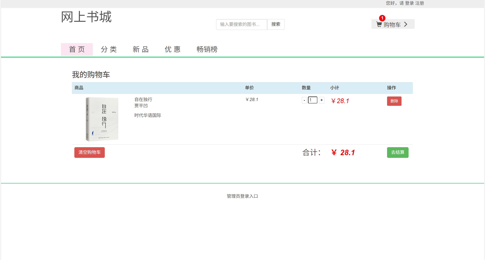
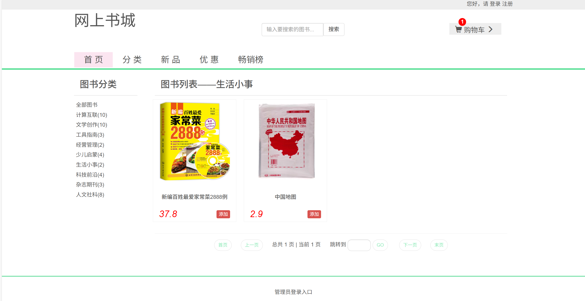
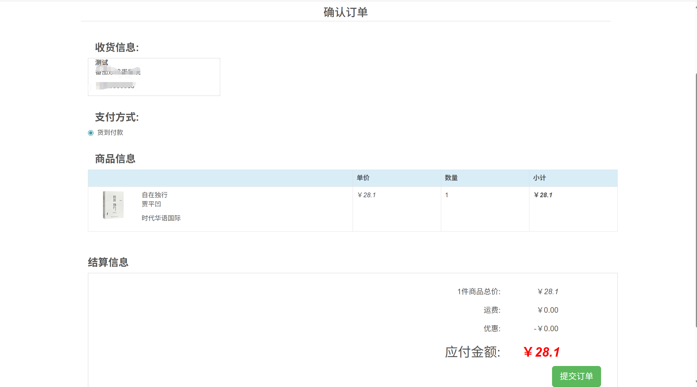
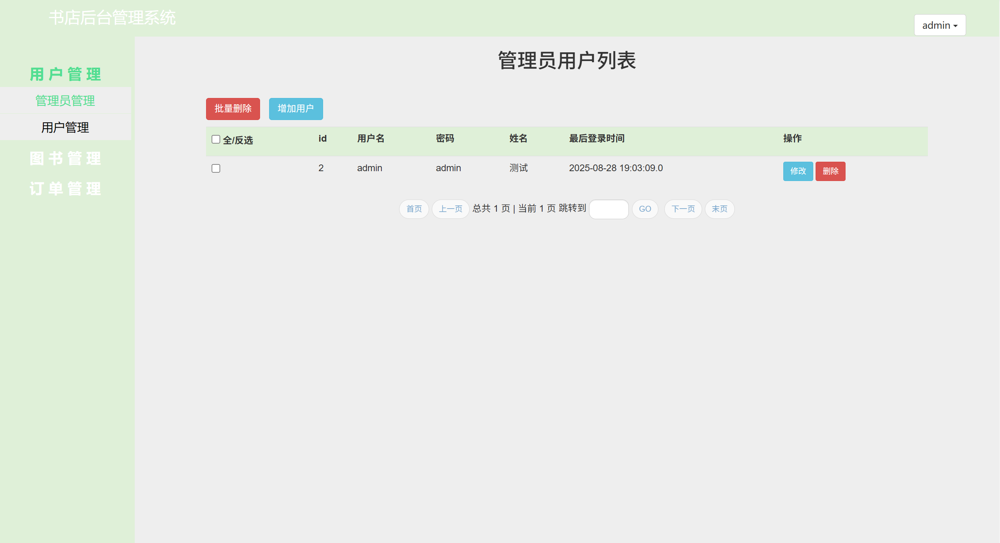
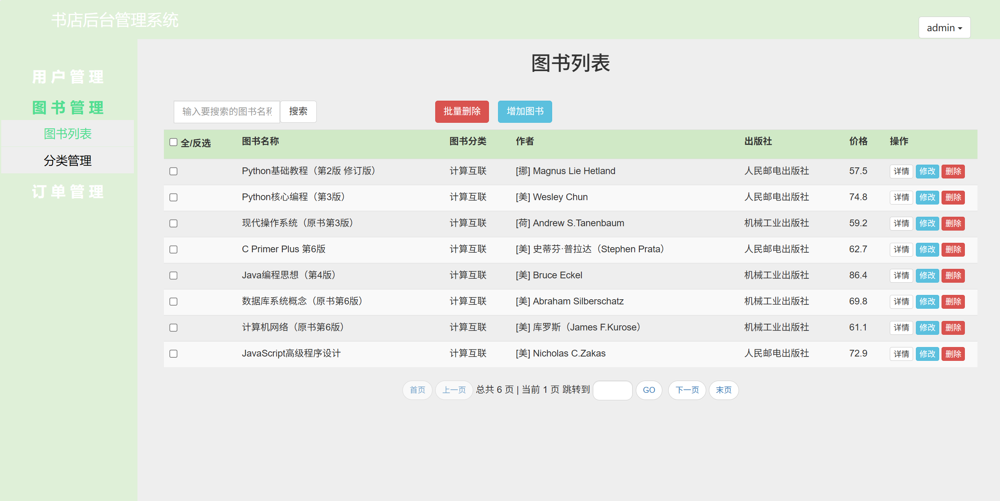
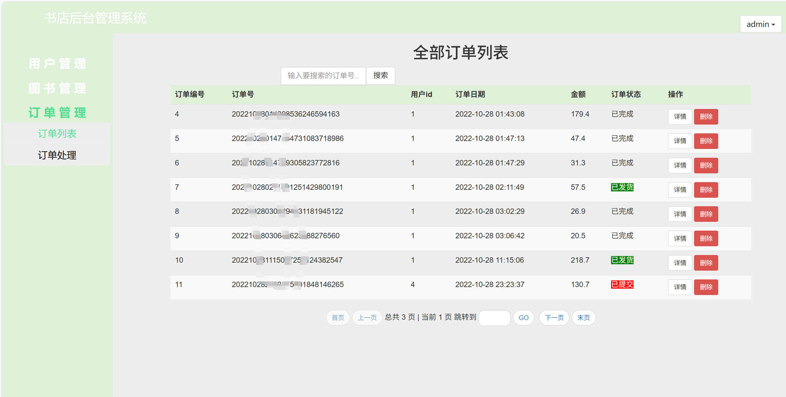

# jspServlet016
jspServlet016网上书店商场管理系统+BG
 
## 查看主页获取源码

### 一、关键词

网上书店商场管理系统，书店商场管理系统

### 二、作品包含
源码+数据库+设计报告文档+全套环境和工具资源+本地部署教程

### 三、项目技术
前端技术：Html、Css、Js、Jquery
后端技术：Java、JSP、Servlet、JDBC

### 四、运行环境（以下版本亲测，其他版本兼容性请自行测试）
开发工具：IDEA/eclipse

数据库：MySQL5.7或8.0

服务器：Tomcat8.5或Tomcat9.0

数据库管理工具：Navicat10以上版本

环境配置软件： JDK1.8

浏览器：谷歌浏览器

### 五、项目介绍
项目编号：jspServlet016

电子商务(Electronic Commerce)是互联网上出现的新概念。它是利用计算机技术、网络技术和远程通信技术，实现整个商务(买卖)过程中的电子化、数字化和网络化。随着它的广泛使用,给人们带来了便利，并逐渐改变了人们的生活方式. 

主要实现了以下模块功能：会员注册、登录/注销；用户管理；浏览图书详细信息；图书搜索；图书管理；购物车；订单；订单管理等。

### 六、运行截图

